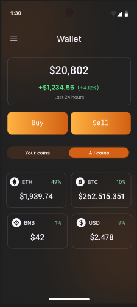
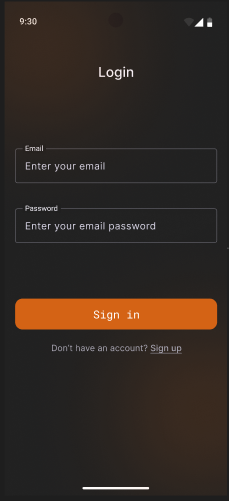
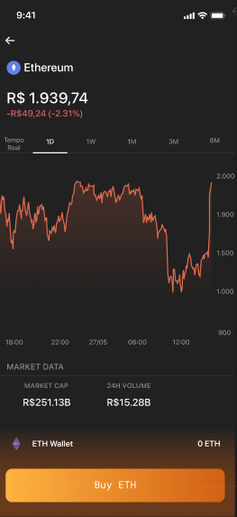
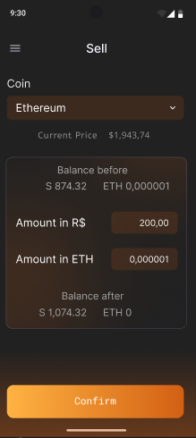

# CryptoWalletFake

## 👥 Participantes

* Gabriela de Souza
* Douglas Costa Ferreira
* Jonas Melo da Paz
* Anderson dos Santos Carvalho
* Felipe Saboya de Santa Cruz Abreu

---

## 📖 Visão Geral

O CryptoWalletFake foi desenvolvido para simular a experiência de um aplicativo real de carteira de criptomoedas, integrando autenticação de usuários, cotações de mercado em tempo real (via CoinGecko e Binance) e uma carteira com saldo persistido localmente no dispositivo.

### Principais Funcionalidades

* Login e cadastro de usuários com Firebase Authentication
* Persistência do perfil do usuário no Firestore
* Consulta de saldo total da carteira (em reais) e variação nas últimas 24 horas
* Compra e venda simuladas de criptomoedas (Buy/Sell)
* Tela de confirmação/sucesso da transação com animação de confete
* Listagem de todas as moedas disponíveis e das moedas da carteira do usuário
* Dashboard/detalhe da moeda com gráfico histórico de preço
* Seleção de período do gráfico (Tempo Real, 1D, 1W, 1M, 3M, 6M)
* Cotações via CoinGecko API e klines/candles via Binance API
* Persistência do estado da carteira localmente com DataStore

## 🎯 Objetivo do Projeto

Permitir que o usuário do aplicativo possa:

* Criar uma conta e autenticar-se de forma segura via Firebase;
* Visualizar o saldo consolidado da carteira e sua variação percentual em 24h;
* Acompanhar a cotação de diferentes criptomoedas (Bitcoin, Ethereum, BNB, USDC, entre outras);
* Simular operações de compra e venda de ativos, com atualização imediata do saldo;
* Analisar o histórico de preço de uma moeda através de gráficos por período;
* Manter o estado da carteira mesmo após fechar o aplicativo, através de persistência local.

## 📱 Capturas de Tela

| Carteira (Home) | Login | Detalhe da Moeda | Venda (Sell) |
|:---:|:---:|:---:|:---:|
|  |  |  |  |

## 🏛️ Arquitetura

O projeto segue o padrão arquitetural **MVVM (Model-View-ViewModel)**, com Jetpack Compose na camada de interface e separação clara entre apresentação, regras de negócio e acesso a dados.

### Estrutura de Camadas

**View**
Telas em Jetpack Compose (`view/`), responsáveis pela apresentação e interação com o usuário, com componentes reutilizáveis em `view/component/` (cards, botões, gráfico de preço, seletor de período, etc.).

**ViewModel**
Responsável pelo gerenciamento de estado de cada tela (loading, sucesso, erro) e pela comunicação com os repositórios (`viewmodel/`).

**Repository**
Centraliza o acesso aos dados, abstraindo as origens remota (CoinGecko, Binance, Firebase) e local (DataStore) (`data/repository/`).

**Remote**
Comunicação com APIs REST através do Retrofit (CoinGecko e Binance) e integração com Firebase Auth/Firestore (`data/remote/`).

**Local**
Persistência local do estado da carteira utilizando DataStore Preferences (`data/local/`).

**Model**
Estruturas de dados que representam moedas, usuário, carteira e transações (`model/`).

**Navigation**
Grafo de navegação em duas camadas: autenticação (Login → Dashboard) e navegação interna do app (Wallet → Trade → TransactionSuccess / Dashboard) (`navigation/`).

## 📂 Estrutura do Projeto

```
com.cryptowallet
│
├── data
│   ├── local
│   │   ├── WalletDataStore.kt
│   │   └── WalletLocalDataSource.kt
│   │
│   ├── remote
│   │   ├── api
│   │   │   ├── CoinGeckoApi.kt
│   │   │   └── BinanceApi.kt
│   │   ├── constants/CurrencyConstants.kt
│   │   ├── dto
│   │   ├── enums/ChartRangeEnum.kt
│   │   ├── service/CoinGeckoService.kt
│   │   ├── BinanceWebSocketManager.kt
│   │   └── RetrofitInstance.kt
│   │
│   └── repository
│       ├── AuthRepository.kt
│       ├── BinanceRepository.kt
│       ├── CoinGeckoRepository.kt
│       ├── WalletRepository.kt
│       └── WalletRepositoryImpl.kt
│
├── model
│   ├── CoinGeckoMappers.kt
│   ├── CoinGeckoModels.kt
│   ├── CoinGraphPoints.kt
│   ├── User.kt
│   └── WalletModels.kt
│
├── navigation
│   ├── AppNavigation.kt
│   ├── CryptoWalletNavHost.kt
│   └── Routes.kt
│
├── ui.theme
│
├── util
│   └── NumberFormatUtils.kt
│
├── view
│   ├── AuthScreen.kt
│   ├── WalletScreen.kt
│   ├── BuySellScreen.kt
│   ├── DashboardScreen.kt
│   ├── TransactionSuccessScreen.kt
│   └── component
│
├── viewmodel
│   ├── AuthViewModel.kt
│   ├── WalletViewModel.kt
│   ├── BuySellViewModel.kt
│   └── DashboardViewModel.kt
│
└── MainActivity.kt
```

## 🔄 Fluxo de Navegação

```
Login (Firebase Auth)
  └──▶ Wallet (Home)
        ├──▶ Trade (Buy/Sell) ──▶ TransactionSuccess ──▶ Wallet
        └──▶ Dashboard (detalhe da moeda) ──▶ Trade (Buy)
```

Ao abrir o app, verifica-se se há um usuário autenticado no Firebase (`FirebaseAuth.currentUser`): caso positivo, o usuário vai direto para a Carteira; caso contrário, é direcionado para o Login.

## 📱 Telas do Aplicativo

### Login / Cadastro

Autenticação via Firebase Authentication (e-mail e senha).

**Funcionalidades**

* Entrar com e-mail e senha;
* Criar nova conta (nome, e-mail e senha), com o perfil salvo no Firestore;
* Redirecionamento automático para a Carteira quando já existe sessão ativa.

### Carteira (Home)

Tela principal da aplicação.

**Funcionalidades**

* Exibição do saldo total da carteira em reais;
* Variação do saldo nas últimas 24 horas (valor e percentual);
* Botões de ação rápida para Compra (Buy) e Venda (Sell);
* Alternância entre "Suas moedas" e "Todas as moedas";
* Listagem de moedas com ícone, variação percentual e saldo em cada ativo;
* Navegação para o detalhe de uma moeda ao tocar nela.

### Compra / Venda (Trade)

Fluxo de simulação de compra e venda de uma criptomoeda.

**Funcionalidades**

* Seleção do valor a comprar/vender;
* Cálculo automático da quantidade de moeda equivalente ao valor em reais;
* Validação de saldo disponível;
* Atualização do estado da carteira persistido localmente ao confirmar.

### Sucesso da Transação

Tela de confirmação exibida após uma compra ou venda concluída.

**Funcionalidades**

* Resumo da transação (tipo, moeda e quantidade);
* Animação de confete (Konfetti) para reforçar o feedback positivo;
* Retorno rápido para a Carteira.

### Dashboard (Detalhe da Moeda)

Exibe informações detalhadas de uma criptomoeda específica.

**Funcionalidades**

* Preço atual e variação no período selecionado;
* Gráfico histórico de preços (Vico);
* Filtro por período: Tempo Real, 1D, 1W, 1M, 3M, 6M;
* Saldo do usuário naquela moeda;
* Ação de compra rápida da moeda (Buy).

## 🧩 Modelo de Dados

### User

```kotlin
data class User(
    val uid: String = "",
    val name: String = "",
    val email: String = "",
    val createdAt: Long = 0L,
)
```

### WalletState / WalletHolding

```kotlin
data class WalletHolding(
    val coinId: String,
    val symbol: String,
    val amount: Double,
)

data class WalletState(
    val cashBalanceReais: Double,
    val holdings: List<WalletHolding>,
)
```

### WalletBalance

```kotlin
data class WalletBalance(
    val totalReais: Double,
    val changeAmount24h: Double,
    val changePercentage24h: Double,
)
```

### TransactionRequest / TransactionResult

```kotlin
data class TransactionRequest(
    val type: TransactionType, // BUY ou SELL
    val coinId: String,
    val amountInReais: Double,
    val amountInCoin: Double,
)

data class TransactionResult(
    val type: TransactionType,
    val coinSymbol: String,
    val amountInCoin: Double,
    val newWalletState: WalletState,
)
```

## ⚙️ Tecnologias Utilizadas

**Linguagem**

* Kotlin

**Interface**

* Jetpack Compose
* Material Design 3 + Material Icons Extended
* Navigation Compose (com rotas tipadas via `kotlinx.serialization`)
* Vico (gráficos de preço)
* Konfetti Compose (animação de confete)
* Coil (carregamento de imagens/ícones das moedas)

**Arquitetura**

* MVVM (Model-View-ViewModel)

**Autenticação e Backend**

* Firebase Authentication (login/cadastro)
* Firebase Firestore (persistência do perfil do usuário)

**Comunicação com APIs**

* Retrofit + Gson Converter
* CoinGecko API (cotações e histórico de preço)
* Binance API (klines/candles)

**Processamento Assíncrono**

* Kotlin Coroutines

**Persistência Local**

* DataStore Preferences (estado da carteira)

## 📋 Requisitos do Projeto

Com base no arquivo `app/build.gradle.kts`.

**Ambiente**

* Android Studio
* JDK 11
* Gradle (AGP 9.2.1)
* Kotlin 2.2.10
* Android SDK

**SDKs**

```
Compile SDK: 37
Target SDK : 36
Min SDK    : 30
```

## 🔌 APIs Utilizadas

**CoinGecko** — `https://api.coingecko.com/api/v3/coins/`

```
GET {id}/market_chart   -> histórico de preço para o gráfico
GET {id}/ohlc            -> candles OHLC
GET markets               -> listagem/dados de moedas
```

**Binance** — `https://api.binance.com/`

```
GET api/v3/klines        -> candles por símbolo/intervalo
```

**Firebase**

* Authentication (e-mail/senha)
* Firestore (`users` collection) — regras em [firestore.rules](firestore.rules)

## 💾 Persistência Local

O projeto utiliza **DataStore Preferences** para armazenar o estado da carteira do usuário (saldo em reais e quantidade de cada moeda), permitindo que o app funcione de forma consistente entre sessões sem depender de um backend próprio para as transações simuladas.
